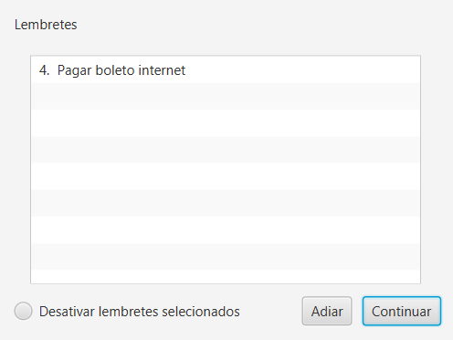
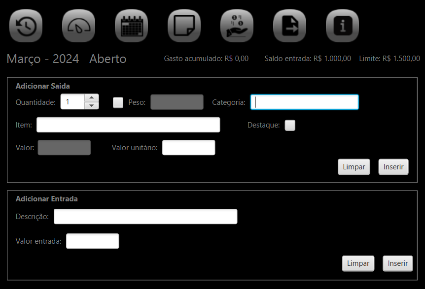
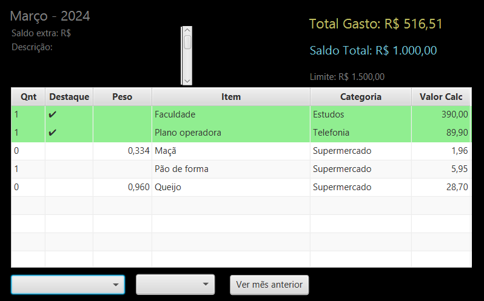

## Controle de Gasto Mensal

Controle de gasto mensal é um aplicativo simples desenvolvido para controle de finanças pessoais onde o usuário pode inserir as entradas e saídas de dinheiro no mês e ter o históricos dos seus gastos. 
 

  

  

O aplicativo ainda possui:
* Função definir limite de gastos que é exibido na tela inicial junto do total gasto no mês. 
* Lembretes para o mês atual ou meses seguintes para lembrar o usuário de coisas importantes sempre que abrir o aplicativo.
* Histórico de gastos dos mese anteriores.
* Função para exportar e importar os dados para outro computador para não perder o controle dos gastos.

*********
Instalação

Para instalar o aplicativo basta baixar e executar o arquivo que pode ser encontrado no release deste repositório seguindo os passos do instalador. Não é necessário a instalação do jdk o jre do Java.

Para executar basta abrir o atalho criado na área de trabalho ou o arquivo exec.vbs na pasta de instalação do aplicativo.

*********

O aplicativo Controle de gasto mensal foi desenvolvido para recordar e melhorar o meu conhecimento em Java e SQLite e aprender a utilizar a biblioteca JavaFX.

Para desenvolver o aplicativo utilizei 
* Java OpenJDK 17.0.8
* JavaFX 20.0.2
* Controlsfx 11.2.0
* SQLite 3.43.0.0
  
Mais em: 
